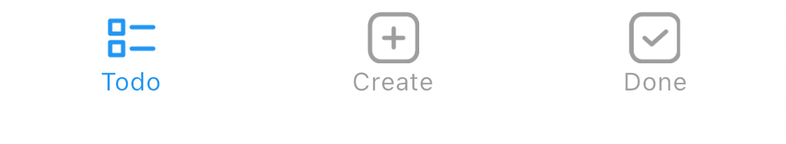

## `Stateless` 위젯에서 탭할시 아이콘 이미지 색 바꾸기

<br/>

### 문제 상황




<br/>

네비게이션 탭바를 `Stateful` 위젯으로 만들어 탭할시 파란색 아이콘 이미지로 바꿀 수 있었으나 가급적 `Stateless` 위젯을 사용하여 최적화 시키고 싶었습니다.

 <br/>

# 

 ### 배경 지식
참고링크: 
[https://api.flutter.dev/flutter/dart-ui/BlendMode.html](https://api.flutter.dev/flutter/dart-ui/BlendMode.html)

<br/>


 #### Flutter의 UI렌더링 과정 이해하기

 - Flutter의 UI렌더링 과정은 아래와 같습니다.
1. 개발자가 작성한 코드를 통해 위젯 트리가 생성됩니다.
2. 위젯 트리가 빌드된 후, Flutter는 상태와 위젯트리 생명주기를 관리하는 `Element Tree`, 그리고 위젯의 위치와 크기 정보를 가지고 있는 `Render Tree`를 만듭니다.
3. 상위위젯부터 하위위젯까지 제약조건이 잡히고, 다시 하위부터 상위까지 사이즈가 결정되어 레이아웃이 잡히면 `Render Widget`에서는 `paint` 단계를 진행하면서 레이아웃이 잡힌 위젯의 내부 구현을 채우게 됩니다.
4. **Paint phase** 는 상위부터 하위로 진행되며 각 위젯의 그래픽 내용을 `Canvas`에 그리게 됩니다.
5. 페인트 단계가 끝나면 다음으로는 **Compositioning phase** 로 넘어갑니다. 여기서는 만들어진 레이어들이 합쳐저 최종이미지를 생성하게됩니다. 이곳에서 `Blend Mode`가 적용됩니다.


<br>

 #### `ColorFiltered` 와 `BlendMode` 이해하기

- `BlendMode` 타입은 **Compositioning Phase**에서 두 가지 객체가 어떻게 혼합되는지 결정하는 방법을 `enum`으로 나열해둔 타입입니다.
- 여기서 두가지 객체란 `Source Object`와 `Destination Object`로  전자는 새로그리려는 그래픽 요소, 후자는 이미 캔버스에 존재하는 그래픽요소입니다.
- `BlendMode`의 `enum` 에 정의된 방법을 하나 선택하여 두 객체를 어떻게 결합해서 UI를 보여줄 것인지 개발자가 정의할 수 있습니다. 예를들어 `BlendMode.multiply`를 선택하면 두 객체의 색상을 곱하여 더 어두운 색상을 생성합니다. 결과적으로 두 사각형이 겹치는 영역은 더 어두운 색상으로 나타납니다.
- 이러한 `BlendMode` 타입은 `ColorFiltered` 클래스 내부에 선언되어있습니다. 따라서 `ColorFiltered` 클래스를 통해 위젯에 다양한 필터효과를 적용시킬 수 있습니다.

 <br/>

 #

 ### 문제 해결


```Dart
Widget build(BuildContext context) {
    return ColorFiltered(
        colorFilter: ColorFilter.mode(
          isSelected ? Colors.blue : Colors.grey,
          BlendMode.srcIn,
        ),
        ...
    );
}
```

- `Colorfiltered` 클래스를 통해 `BlendMode` enum타입에 접근하여 `srcIn` 을 설정해줍니다.
- `srcIn`를 채택하게되면, 두 이미지가 겹치는 부분에서만 `Source Object`를 보여주는 역할을 합니다. 여기서 `Destination Object`는 렌더링되지 않고 단순히 마스크로 취급됩니다. 대상 이미지의 색상 채널은 무시되고 오직 불투명도(opacity)만 영향을 미치는 효과를 얻을 수 있습니다.