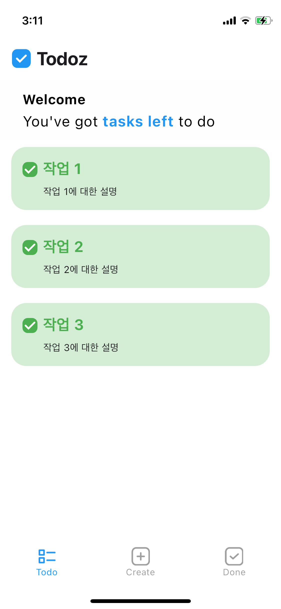

## 자연스러운 모서리 UI 구현하기 (feat. Squircle)

 

### 문제 상황

 
 

 
 

- 홈페이지 UI를 구현했으나 실기기에서 확인해보니 곡선이 무언가 자연스럽지가 않았다.
- 체크박스는 크기가 작아 눈에 띄지 않았지만 `todo sliver`의 모서리는 눈에 띌 정도로 각이 져있어 앱이 무언가 투박해 보이는 인상을 주었다.
- 구글링을 한 결과 자연스러운 모서리를 주는 디자인 용어로 **squircle** 키워드를 알게되었고 만들어진 패키지를 사용하는 것보다 학습을 위해 직접 구현해보기로 했다.
- [squircle을 사용하는 이유 (유튜브 동영상)](https://www.youtube.com/watch?v=o2-qTvOR1rY)

 

#

### 배경 지식

 

#

### 문제 해결